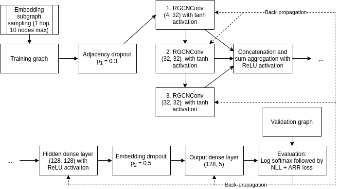

# RS via GNN

## Overview
This repository contains experiment code for the 
master thesis 

***Recommender Systems via Graph Neural Networks***.

We address:
* Fundamental proof of concept for the _Message Passing_ paradigm
* MLN baselines for different RS data sets
* GNN experiments for different RS data sets using
  * GCMC
  * IGMC

## Structure
_Only relevant files and folders are listed:_
* __00_zachary__
  
    To warm-up, we showcase several versions of the ZKC separation both in Pytorch Geometric (PyG) and Deep Graph Library (DGL).

    

  * [Zachary_GCN_DGL.ipynb](00_zachary/Zachary_GCN_DGL.ipynb): Node classification show case using DGL
  * [Zachary_GCN_pyG.ipynb](00_zachary/Zachary_GCN_pyG.ipynb): Alternative node classification approach using PyG.
  * [Zachary_GCN_untrainded.ipynb](00_zachary/Zachary_GCN_untrained.ipynb): Vanilla implementation, even without training some separation is noticeable.
* __01_mln-baselines__

    As baseline we use a standard MLN in three sizes.

  
  
  * amazon-electronic
    * [amazon-electronic-descriptive-analysis.ipynb](01_mln-baselines/amazon-electronic/amazon-electronic-descriptive-analysis.ipynb): Descriptive analysis for Amazon Electronic Products data set
    * [amazon-electronic-mln.ipynb](01_mln-baselines/amazon-electronic/amazon-electronic-mln.ipynb): MLN models for Amazon Electronic Products data set
  * goodreads
    * [goodreads-descriptive-analysis.ipynb](01_mln-baselines/goodreads/goodreads-descriptive-analysis.ipynb): Descriptive analysis for Goodreads data set
    * [goodreads-mln.ipynb](01_mln-baselines/goodreads/goodreads-mln.ipynb): MLN for Goodreads data set
  * movielens
    * [movielens-descriptive-analysis.ipynb](01_mln-baselines/movielens/movielens-descriptive-analysis.ipynb): Descriptive analysis for ML-100k, ML-1M and ML-10M
    * [movielens-mln-ml-100k.ipynb](01_mln-baselines/movielens/movielens-mln-ml-100k.ipynb): MLN models for ML-100k data set
    * [movielens-mln-ml-1m.ipynb](01_mln-baselines/movielens/movielens-mln-ml-1m.ipynb): MLN models for ML-1M data set
    * [movielens-mln-ml-10m.ipynb](01_mln-baselines/movielens/movielens-mln-ml-10m.ipynb): MLN models for ML-10M data set
* __02_gcmc__

  As first GNN we evaluate Graph Convolutional Matrix Completion

  Link to the paper: https://arxiv.org/pdf/1706.02263
  
  
  
  * amazon-electronic
    * [train.py](02_gcmc/amazon-electronic/train.py): GCMC training for Amazon Electronic Products data set
    * [model.py](02_gcmc/amazon-electronic/model.py): GCMC model for Amazon Electronic Products data set
    * [amazon_gcmc_training_visualization.ipynb](02_gcmc/amazon-electronic/amazon_gcmc_training_visualization.ipynb): Loss visualization for Amazon Electronic Products data set
  * goodreads
    * [train.py](02_gcmc/goodreads/train.py): GCMC training for Goodreads data set
    * [model.py](02_gcmc/goodreads/model.py): GCMC model for Goodreads data set
    * [goodreads_gcmc_training_visualization.ipynb](02_gcmc/goodreads/goodreads_gcmc_training_visualization.ipynb): Loss visualization for Goodreads data set
  * movielens
    * [train.py](02_gcmc/movielens/train.py): GCMC training for Movielens data sets (all used variants)
    * [model.py](02_gcmc/movielens/model.py): GCMC model for Movielens data sets (all used variants)
    * [movielens_gcmc_training_visualization.ipynb](02_gcmc/movielens/movielens_gcmc_training_visualization.ipynb): Loss visualization for Movielens data sets (all used variants)
    
* __03_igmc__
  
  As second GNN we evaluate Inductive Graph-based Matrix Completion

  Link to the paper: https://openreview.net/pdf?id=ByxxgCEYDS

  
  
  * [Main.py](03_igmc/Main.py): IGMC training
  * [models.py](03_igmc/models.py): IGMC model 
    
## Environment / Installation

It is suggested to use a dedicated python instance.
We use _conda_. Required packages can be found in `environment.yml`.
See [conda docs](https://docs.conda.io/projects/conda/en/latest/user-guide/tasks/manage-environments.html#creating-an-environment-from-an-environment-yml-file) for further instructions.

## Credits
For our experiments we heavily rely on other people's work.
We thank everyone who made her research and code publicly available.
The original sources are marked in the individual files.

Here is the list of GNN frameworks (which we suggest as a starting point for others interested in crafting GNNs):
* https://github.com/dmlc/dgl/
* https://github.com/rusty1s/pytorch_geometric
* https://github.com/danielegrattarola/spektral